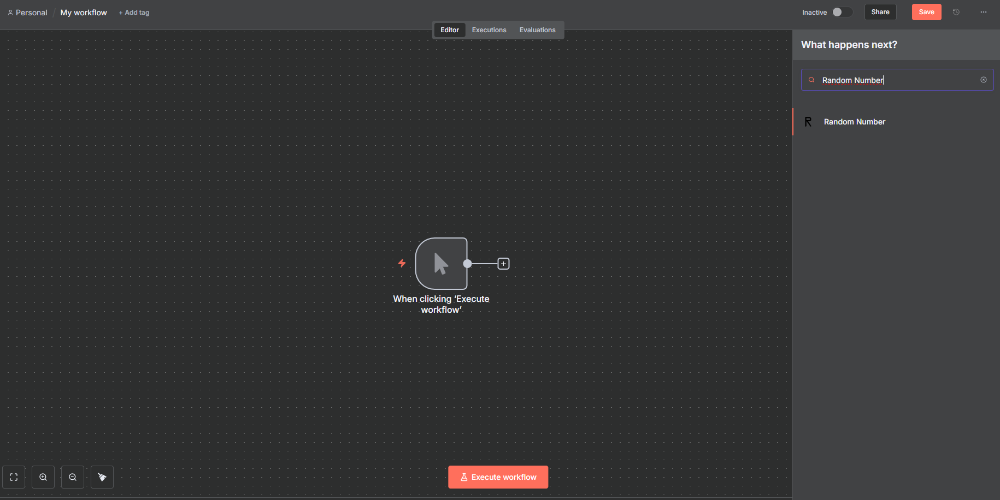
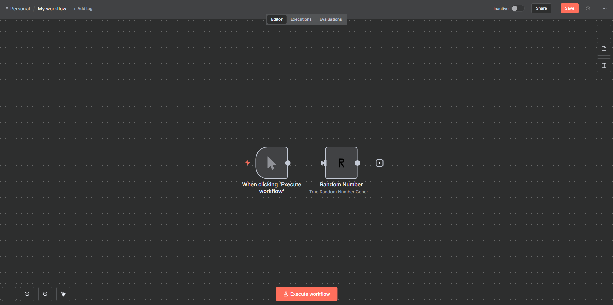
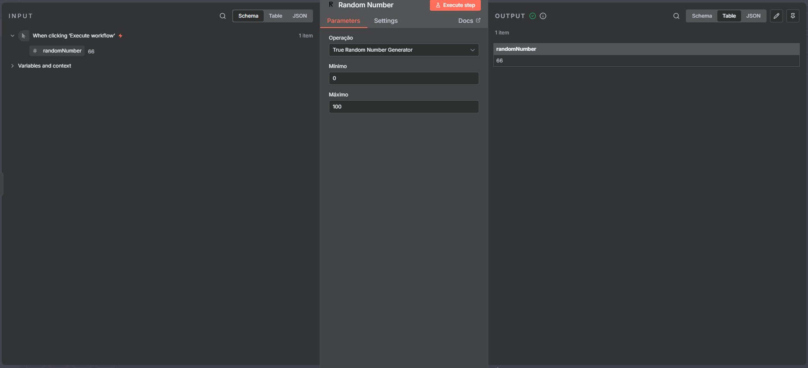

# self-hosted-n8n with custom RandomNumber node

This repository runs an n8n instance in Docker Compose and includes a custom programmatic node (Random Number) under `custom-nodes/n8n-nodes-randomnumber`.

Quick start (PowerShell):

## self-hosted n8n com node customizado (RandomNumber)

Este repositório fornece um ambiente self-hosted do n8n orquestrado com Docker Compose e com suporte para um pacote de node customizado localizado em `custom-nodes/n8n-nodes-randomnumber`.

Este README descreve como configurar, instalar dependências, executar os serviços em contêineres Docker, configurar variáveis de ambiente, rodar testes e dicas de desenvolvimento do node customizado.

### Sumário

- Visão geral
- Requisitos
- Instalação e build do node customizado

## self-hosted n8n com node customizado (RandomNumber)

Este repositório contém uma configuração para executar o n8n localmente via Docker Compose e um pacote de node customizado em `custom-nodes/n8n-nodes-randomnumber`.

O objetivo deste README é fornecer um guia profissional e completo para:

- Instalar dependências do projeto e do pacote customizado
- Construir o pacote customizado (npm / pnpm)
- Executar o ambiente usando Docker Compose
- Configurar variáveis de ambiente e banco de dados
- Executar testes (quando existirem)
- Dicas de desenvolvimento (hot-reload, troubleshooting)

Conteúdo rápido

- Requisitos
- Instalação e build do node customizado
- Executando com Docker (local)
- Variáveis de ambiente (.env)
- Verificação e troubleshooting
- Testes
- Boas práticas e notas de produção

## Requisitos

- Docker (recomenda-se Docker Desktop no Windows) com Compose v2 (o comando usado aqui é `docker compose`)
- Node.js (18+ recomendado) — necessário apenas para construir o pacote customizado
- pnpm (opcional, recomendado para este projeto) ou npm/yarn
- PowerShell (os exemplos abaixo usam PowerShell; adapte se usar outro shell)

Observação: neste repositório o fluxo de build do node customizado foi executado com `pnpm` nos exemplos, mas `npm` funciona na maioria dos casos (alguns scripts ou dependências podem preferir `pnpm`).

## Passo a passo — instalar dependências e construir o pacote customizado

1. Abra um terminal PowerShell e posicione-se na raiz do projeto:

```powershell
cd C:\Users\diogo\testes\self-hosted-n8n-node-randomnumber
```

2. Copie o arquivo de variáveis de ambiente de exemplo e ajuste os valores sensíveis:

```powershell
cp .env.example .env
# Edite .env com um editor de texto e defina POSTGRES_USER, POSTGRES_PASSWORD, POSTGRES_DB,
# N8N_ENCRYPTION_KEY e N8N_USER_MANAGEMENT_JWT_SECRET antes de subir os containers.
```

3. Instale e construa o pacote de node customizado (se existir código dentro de `custom-nodes/n8n-nodes-randomnumber`):

```powershell
cd .\custom-nodes\n8n-nodes-randomnumber
pnpm install
pnpm run build
# Ou, se preferir npm:
# npm install
# npm run build
cd -
```

Notas:

- Se você usar `pnpm` e aparecer um aviso sobre "Ignored build scripts" ao instalar, execute `pnpm approve-builds` para decidir quais scripts de build serão permitidos.
- Em alguns ambientes poderão surgir avisos de peer dependencies (por exemplo versões do TypeScript). Se for apenas aviso, normalmente não impede a build do pacote.

## Executando a aplicação com Docker Compose (local)

Este repositório inclui um `docker-compose.yml` que define os serviços mínimos: Postgres, n8n e um serviço auxiliar (`n8n-import`) para importação inicial.

Recomendo executar com o profile usado no exemplo (se você precisar do perfil GPU use `--profile gpu-nvidia`):

```powershell
docker compose --profile gpu-nvidia up -d
```

Verifique os status dos containers:

```powershell
docker compose ps
```

Acompanhe os logs do n8n:

```powershell
docker compose logs -f n8n
```

Após a inicialização, o painel do n8n ficará disponível em:

http://localhost:5678

Se você alterar as portas no `docker-compose.yml`, ajuste o URL conforme necessário.

## Configuração de ambiente (.env)

Principais variáveis que você deve configurar no `.env` (o repositório inclui `.env.example`):

- POSTGRES_USER — usuário do Postgres (ex: root)
- POSTGRES_PASSWORD — senha do Postgres
- POSTGRES_DB — nome do banco (ex: n8n)
- N8N_ENCRYPTION_KEY — chave de encriptação usada pelo n8n (use um valor forte)
- N8N_USER_MANAGEMENT_JWT_SECRET — segredo JWT para o gerenciamento de usuários
- N8N_DEFAULT_BINARY_DATA_MODE — `filesystem` (recomendado para desenvolvimento) ou `database`

Exemplo mínimo (já presente em `.env.example`):

```text
POSTGRES_USER=root
POSTGRES_PASSWORD=password
POSTGRES_DB=n8n

N8N_ENCRYPTION_KEY=super-secret-key
N8N_USER_MANAGEMENT_JWT_SECRET=even-more-secret
N8N_DEFAULT_BINARY_DATA_MODE=filesystem
```

Avisos importantes e deprecações observadas na inicialização:

- O n8n pode exibir avisos sobre `N8N_RUNNERS_ENABLED` e `N8N_BLOCK_ENV_ACCESS_IN_NODE`. Para compatibilidade futura, defina `N8N_RUNNERS_ENABLED=true` se quiser habilitar task runners agora. Se você precisa permitir acesso direto a variáveis de ambiente dentro de nodes/expressões, defina `N8N_BLOCK_ENV_ACCESS_IN_NODE=false`.
- O serviço também pode reclamar das permissões do arquivo de configurações (ex: "Permissions 0644 for n8n settings file ... are too wide"). Normalmente isso é apenas um aviso; se desejar, configure `N8N_ENFORCE_SETTINGS_FILE_PERMISSIONS=true` para forçar a correção automática.

## Como verificar se o node customizado foi carregado

1. No painel do n8n, abra o editor de workflows e verifique a lista de nodes — procure por "RandomNumber" (ou o nome do node exportado pelo seu pacote).
2. Alternativamente, verifique os logs do container n8n para mensagens de carregamento do pacote customizado:

```powershell
docker compose logs n8n --tail 200
```

3. Confirme que a pasta `custom-nodes/n8n-nodes-randomnumber` foi montada no container (substitua o nome do container se necessário):

```powershell
docker compose exec n8n ls -la /home/node/custom-nodes
```

Se o pacote não aparecer, confirme:

- A pasta local existe e contém `package.json` e `dist/` (ou o código compilado conforme o `main`/`exports` do package)
- O `docker-compose.yml` monta corretamente o diretório `custom-nodes` dentro do container

## Executando testes

Idealmente, você poderá ver, implementar e testar o conector customizado conforme nas imagens




## Troubleshooting — problemas comuns e soluções rápidas

- Aviso "Permissions 0644 for n8n settings file ... are too wide":

  - Mensagem informativa. Para aplicar correção automática, defina `N8N_ENFORCE_SETTINGS_FILE_PERMISSIONS=true` no `.env`.

- Migrations no `n8n-import` e logs longos de migração:

  - O processo `n8n-import` aplica migrations ao banco. Se ele terminar com exit code 0, a importação foi concluída.

- Se o Postgres não sobe ou o n8n não conecta ao banco:
  - Verifique `POSTGRES_*` no `.env` e as variáveis de conexão no `docker-compose.yml`.
  - Verifique volumes (às vezes é útil remover volumes durante desenvolvimento com cuidado):

```powershell
docker compose down -v
```
